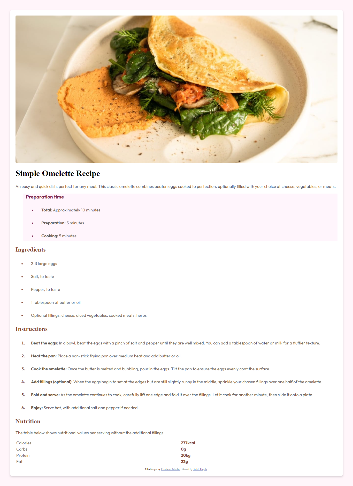

# Frontend Mentor - Recipe page solution

This is a solution to the [Recipe page challenge on Frontend Mentor](https://www.frontendmentor.io/challenges/recipe-page-KiTsR8QQKm). Frontend Mentor challenges help you improve your coding skills by building realistic projects. 

## Table of contents

- [Overview](#overview)
  - [The challenge](#the-challenge)
  - [Screenshot](#screenshot)
  - [Links](#links)
- [My process](#my-process)
  - [Built with](#built-with)
  - [What I learned](#what-i-learned)
  - [Continued development](#continued-development)
  - [Useful resources](#useful-resources)
- [Author](#author)


## Overview

### Screenshot




### Links

- Solution URL: [https://github.com/yMeeraki/recipe-page-main] 
- Live Site URL: [https://frontendmetor-recipe-page.netlify.app/]

## My process

### Built with

- Semantic HTML5 markup
- CSS custom properties
- Flexbox
- Mobile-first workflow
- Google Fonts for typography
- Google icons


### What I learned

This project helped me practice key front-end development concepts, especially CSS layout techniques like Flexbox and media queries for responsiveness. I also learned about structuring a simple recipe webpage, focusing on typography and spacing for better readability. Below are a few highlights:

- HTML: Structuring content with proper use of tags like <ul>, <ol>, and <table>.

```html
          <table>
            <tr>
              <td>Calories</td>
              <th>277kcal</th>
            </tr>
            <tr>
              <td>Protein</td>
              <th>20g</th>
            </tr>
          </table>
```
- CSS: Creating a responsive layout using Flexbox and ensuring images adjust dynamically to different screen sizes.
          img {
            max-width: 100%;   
            height: auto;
            display: block;    
            border-radius: 5px;
          }

### Continued development

Moving forward, I want to explore:

- CSS Grid: I used Flexbox for this project but I want to expand my skillset by incorporating CSS Grid in future projects for more complex layouts.
- JavaScript Interactivity: Implementing interactivity like toggling between different nutrition facts or a "step-by-step" mode for recipe instructions.

### Useful resources

- [CSS Tricks - Flexbox Guide ](https://css-tricks.com/snippets/css/a-guide-to-flexbox) -This was helpful for understanding how Flexbox works, and I applied it to structure my page layout.
- [MDN Web Docs ](https://developer.mozilla.org/en-US/) - For understanding semantic HTML and responsive image handling.


## Author

- Website - [Yukti Gupta](https://frontendmetor-recipe-page.netlify.app/)
- Frontend Mentor - [@yMeeraki](https://www.frontendmentor.io/profile/yMeeraki)


